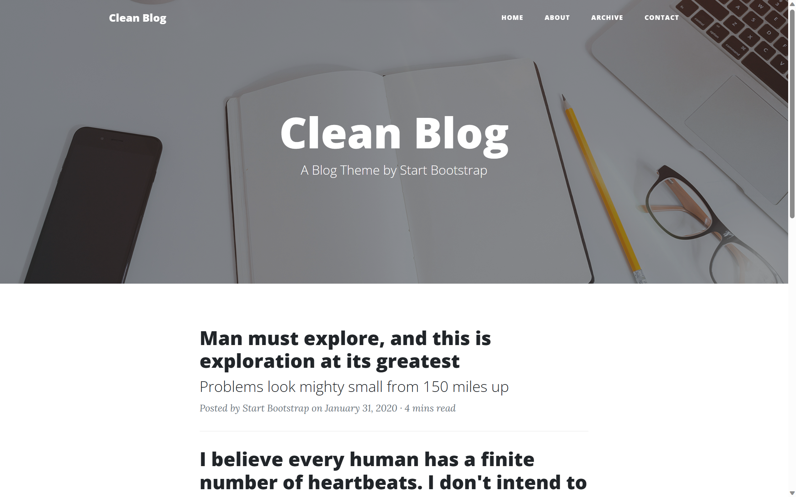

# YerBlogTheme
## A Jekyll theme for YerBlog forked form "[startbootstrap-clean-blog-jekyll](https://github.com/StartBootstrap/startbootstrap-clean-blog-jekyll)".

## Preview

**[View Live Preview](http://StartBootstrap.github.io/startbootstrap-clean-blog-jekyll/)**

## Installation & Setup

### Using Core Files

When using the core files, the demo images, posts, and pages are all included with the download. After following the instructions below, you can then go and change the content of the pages and posts.

1. [Download](https://github.com/jinyery/YerBlogTheme/archive/refs/heads/master.zip) or Clone the repository.
2. Update the following configuration settings in your `_config.yml` file:

    * `baseurl`
    * `url`
    * `title`
    * `email` (after setting this setting to a working email address, fill out the form on the contact page and send it - then check your email and verify the address and the form will send you messages when used)
    * `description`
    * `author`
    * `zhihu_username` (Optional)
    * `weibo_username` (Optional)
    * `twitter_username` (Optional)
    * `facebook_username` (Optional)
    * `github_username` (Optional)
    * `linkedin_username` (Optional)
    * `instagram_username` (Optional)
    * `special_nav_item` (Optional, add your custom nav item to the nav bar. Note that this item cannot be an array, as our philosophy is restraint.)
    * `special_nav_link` (Optional, the link of your custom nav item.)

3. Build your site: `bundle exec jekyll serve`

## Bugs and Issues

Have a bug or an issue with this template? [Open a new issue](https://github.com/jinyery/YerBlogTheme/issues) here on GitHub!

## About

YerBlogTheme is forked from "[startbootstrap-clean-blog-jekyll](https://github.com/StartBootstrap/startbootstrap-clean-blog-jekyll)".Compared to the original version, the following features have been added:  

1. Added support for tags page;
2. Added custom navItem in navBar;
3. Added Utterances as Comment System.

## Copyright and License

Copyright 2023 Start Bootstrap LLC. Code released under the [MIT](https://github.com/jinyery/YerBlogTheme/blob/master/LICENSE) license.
